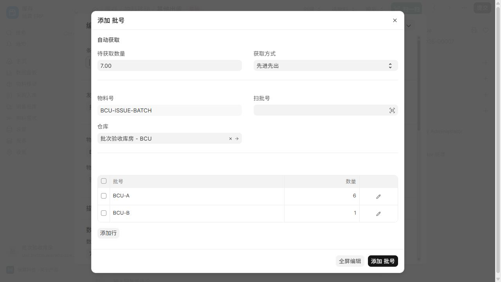
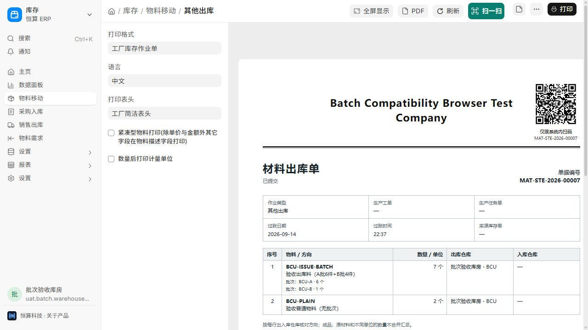
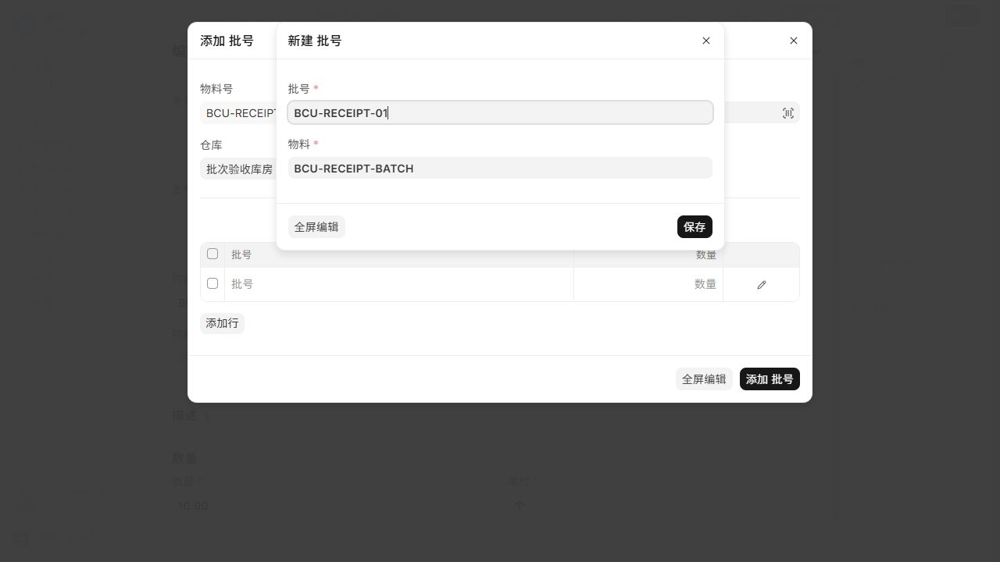

# 恒算 ERP 可选批次兼容实施与验证记录

> 后续记录：同日开始的[交付前本地走查](pre_delivery_audit_20260914.md)扩大了测试范围，修复安全库存/批次补货兼容时新增了一个 ERPNext 原生文件改动，并完成独立实时环境修复。下文“仅改恒算应用”和实时连接未验收是本阶段的历史状态。

验证日期：2026-09-14。范围：本机最新工作区代码与新建隔离测试站。

**实施原则：默认不启用批次，按物料选择是否使用；实际收发、耗用、入库、退回沿用 ERPNext 原生批次和库存单据。现有生产计划、共用库存、生产优先级、余量释放和工人报工规则保持原有设计。**

操作人员先阅读 [批次管理操作卡](batch_quick_start.md)；设计与完整场景目录见 [兼容设计](batch_compatibility_design_20260914.md)。

## 1. 环境和交付范围

| 项目 | 本次证据 |
|---|---|
| 检查基线 | Git HEAD 6b482fcf57；实现留在工作区，未提交或推送 |
| 源码版本 | ERPNext 16.33.0 / Frappe 16.32.0 |
| 修改位置 | 仅 custom_apps/process_simplification，未修改 ERPNext/Frappe 核心 |
| 测试站 | batch-compat-20260914.localhost，独立新建数据库 |
| 浏览器入口 | 本机回环地址 http://localhost:8016；独立测试运行容器 |
| 角色实操 | 纯 Process Simplification Warehouse Operator，限定测试公司和仓库 |
| 现有业务环境 | 未迁移既有开发/生产站，未切换现有物料或历史库存 |
| 当前状态 | 本机实现及本文列明验证已完成；正式站尚未部署，启用前需执行其正常升级和实际业务验收 |

数据库测试与界面数据均使用隔离测试公司、物料、批次和单据。验收结束已把该隔离站 allow_tests 设回布尔 False。测试日志存放在本机 development/logs/batch-compat-20260914，包含早期失败记录；以下以修复后的最后一次模块结果为准，不把重复运行累加。

## 2. 已实施的行为

| 环节 | 最终行为 |
|---|---|
| 快速开单 | 可选择批次物料，与普通物料混合下单；销售不增加批次必填 |
| 库存、齐套与缺料 | 复用原生批次可用量，区分账面数量、有效批次、数量预留和已指定批次；防止漏算或重复扣减 |
| 销售预留 | 关闭自动选批时允许原生 Qty 预留；开启自动选批时沿用原生选择规则 |
| 生产及完工回补 | 已有明确来源时读取来源单实际批次，仅认领可用余量；A 批已转走时不拿 B 批替代 |
| 发货草稿 | 多行累计按库存单位控制数量；不只改单据数量而留下过大的批次分配 |
| 发料、制造与退料 | 沿用原生单据；退料后的制造草稿按实际净发料生成，取消时同步对应原生预留余额 |
| 库房待办 | 提示批次物料，展示已记录批次及每批数量，打开原单核对和提交 |
| 打印 | 收货、库存、发货默认模板展示实际批次、数量、库存单位；接收与拒收分开，普通行不增加空批次栏 |
| 岗位权限 | 库房获得必要选批、新建、Bundle 处理权限；公司、仓库与原单范围仍需符合授权 |
| 安装与升级 | 进入现有可重复安装/迁移及权限同步入口，不强制修改批次功能开关或物料属性 |

### 实测中修正的关键问题

- 原生部分 Bundle 创建入口不填 company；从实际仓库补齐后仍验证公司和仓库权限。
- 原生批次新建弹窗按修改权限判断控件显示；仅在新建批次弹窗内补齐创建时的显示权限，服务器仍验证原生创建权限，不开放已有批次的通用读写。
- 原生批次 RPC 不完全遵守受限岗位的仓库范围；在恒算相关岗位的 RPC 入口校验实际公司、仓库和来源单据，库存计算仍交给原生；Bundle 通用读取、列表与子表查询也沿用同一范围，来源的客户/供应商等权限通过原生权限子查询保留。
- 原生库存设置的默认仓库引用会误挡住受限库房读取设置；仅把共享配置引用排除于用户仓库范围检查，真实交易仓库继续受控，库存设置仍只读。
- 制造前已有退料时，原生带出的耗用批次可能未扣退料；恒算引导制造路径按已提交记录计算净发料，并覆盖顺序取消恢复验证。

## 3. 自动化验证

| 测试模块 | 已通过数量 | 主要证据 |
|---|---:|---|
| test_batch_compat | 31 | 有效池、数量/批次预留、来源认领、跨来源共享预算 |
| test_batch_production | 18 | 原料齐套、来源批次、退料后耗用及路径门控 |
| test_batch_production_integration | 4 | 真实多批发料、制造、退回再发、回补及逆序取消 |
| test_batch_sales | 13 | 快速开单、Qty/指定批次预留、部分发货、客户退回和来源回补 |
| test_batch_native_integration | 3 | 采购接收/拒收和退供、无工单调拨/Repack、批次盘点及取消 |
| test_batch_bundle_permissions | 8 | 新建/修改 Bundle 权限和公司仓库校验 |
| test_batch_display | 12 | 授权原单摘要、批次数量、受限岗位导航、配置引用幂等 |
| test_batch_warehouse_integration | 11 | 真实纯库房选批、保存、提交、打印；RPC 与通用读/list/子表查询，跨仓、他人草稿、原单客户范围和历史异常子仓库拒绝 |
| test_batch_permissions | 35 | 读权限包装与原生调用契约的纯单元测试 |
| test_batch_additional_integration | 2 | 原生采购/销售发票更新库存、退货与取消；两个独立数据库会话争用最后有效批次库存 |
| test_quick_order_v2 | 52 | 普通快速开单回归 |
| test_simplified_flow | 44 | 现有简化流程回归 |
| test_workbench_read_optimization | 22 | 工作台读取与权限回归 |
| test_production_readiness / test_aggregated_shortage | 47 / 13 | 共用物料、承诺与缺料回归 |
| test_planning_stock / test_planning_stock_integration | 4 / 13 | 计划分配与真实数据库锁回归 |
| test_production_workflow | 29 | 现有生产操作回归 |
| test_replenishment_chain / test_replenishment_chain_integration | 10 / 4 | 补产、半成品与回补链回归 |
| test_material_coverage_integration / test_material_routes | 11 / 3 | 实际发退料和原 BOM 组件净覆盖 |
| test_stock_entry_hooks | 24 | 23 单元 + 1 实际单据集成，普通库存路径与生产钩子 |
| test_management_access | 23 | 角色默认权限、客户额外权限保留、权限同步 |
| test_page_refresh / test_factory_print_suite | 18 / 10 | 批次变更刷新及默认打印 |
| 四个受影响 JavaScript 模块 | 103 | 开单、生产、库房页面与事件刷新 |
| batch_quick_entry.test.js | 4 | 仅创建权限的原生弹窗、既有 Batch/其他弹窗/高级字段权限保持 |

上述共 **464 项针对性 Python 测试（单元与数据库集成）**、**107 项前端测试**通过；这不是全项目测试总数。最后一次前端合并运行见 final_javascript.log。应用资源构建通过，32 个修改/新增 Python 文件语法检查及 git diff --check 通过；已确认所有工作区改动均在恒算应用目录，Frappe 核心工作区无改动。

补充并发证据：同仓账面 10 个，其中可用批次 1 个、停用批次 9 个。预先建立两份预留草稿以排除单据编号锁的干扰，两连接均可见旧的可用量 1，再同时尝试提交。仅一份成为已提交预留，另一份明确失败；测试结束通过原生取消，库存、预留和两批数量均为 0。该例验证的是批次预留争用，不冒充“同一完工来源同时回补”的完整双会话验收。

发票证据：原生采购发票入 10 → 销售发票出 4 → 销售退货 4 并取消 → 取消销售发票 → 采购退货 10 并取消 → 取消采购发票，核对 Bundle 与库存。该例采用有原生发票权限的管理账号，受限库房不会自动获得发票权限。

## 4. 纯库房实际页面验收

使用隔离站专用库房账号，未附加 Stock Manager 或 System Manager。该账号仅能操作验收公司与验收仓库，Batch 默认无通用读取/修改权限。

- 在库房工作台找到批次待办，打开原生库存单。
- 在出库单原生选择器中按先进先出获取 7 个：BCU-A 6 个、BCU-B 1 个。
- 同一张出库单另有普通物料 2 个，正常保存和提交。
- 打开“工厂库存作业单”打印预览，显示实际两批数量，普通物料保持普通行。
- 服务端重新读取已提交单据、Bundle 和原生批次余额：A 批 0，B 批 3，普通物料 1；出库 Bundle 为 A -6、B -1，数量一致。

入库实操也已完成：同一纯库房账号新建 BCU-RECEIPT-01，分配 10 个并提交 MAT-STE-2026-00006。服务端确认 Batch 创建人为该库房账号，入库单和 Bundle 均已提交，唯一批次明细为 +10，原生批次库存余额为 10。最后重载最终代码，再次打开出库打印仍显示 A 6、B 1，普通物料行正常。

原生入库选择器的“待获取数量”为 0 时，会出现回写本次数量的确认提示；实际确认前必须核对批次合计与单据数量。录入后离开输入框使数量生效，删除多余空行。该现象属于本机原生选择器交互，本次未重写其计算逻辑。

## 5. 明确边界

1. 本记录证明本机版本与列明路径，不代表正式站已部署、真实工厂已试用，或所有原生功能组合均已逐项验收。
2. 不转换老库存，不补写历史批次。已使用物料如何切换批次属性，必须按原生限制和实际库存安排。
3. 完整原生批次/追溯报表不默认授予受限库房。该类报表需要全量库存查看权限；受限岗位通过授权原单核查。
4. 原生追溯以实际制造投入/产出为依据，部分数量按比例展示，多产出批次存在版本覆盖边界，不能承诺每件产品唯一用料追溯。按实际生产批次分别记录制造单，有助于清楚核对。
5. 序列号、批次标签和按批次扫码拣货未作为本次扩展。现有单据二维码仍用于打开原单。
6. 界面验收为本机桌面浏览器；未将其视为真实手机、现场打印机或生产部署验收。独立测试服务的浏览器日志仍有实时连接错误，因此本次以单据提交、重新加载及库存账核对为界面证据，不把实时推送和跨窗口自动刷新记作部署验收通过。

## 6. 启用顺序

1. 在目标环境按现有升级流程同步恒算应用、构建资源、执行 migrate；保留既有自定义角色和打印模板。
2. 不用批次的企业保持原有设置即可。
3. 需要批次的企业由管理员对选定物料配置原生批次选项、编号和有效期。
4. 使用真实岗位，先演练一笔数量可以核对的采购/发料/制造/发货/退回业务，再扩大使用范围。

