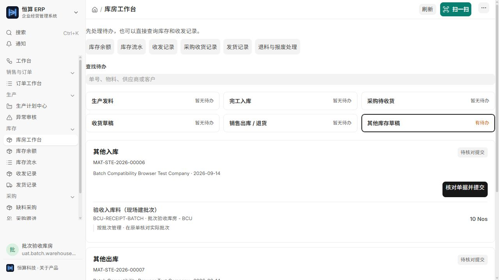

# 恒算 ERP 批次管理操作卡

> 2026-09-17 更新：批次兼容功能已发布到生产，批次保持关闭；初始化与桌面导航问题已补测。详见 [生产发布记录](production_release_20260917.md)。本文原日期的失败与验收边界继续保留。

适用于批次兼容功能，2026-09-14 更新。建议用 8–10 分钟读完，日常按岗位查对应操作卡。

**不用批次的企业，无需更改设置，按原来的方式操作。需要批次时，只对需要追溯的物料启用；销售下单和工人报工仍然保持简单。**

**日常推荐：系统自动生成批号 → 按规则自动选批 → 库房核对实物 → 提交后系统记账。**管理员先完成配置，之后无需每次手工编批号。自动编号和自动选批是不同设置；自动处理不能替代实物识别。

| 环节 | 配置后系统自动做 | 人还要核对 |
|---|---|---|
| 新收货、新产出 | 未指定已有批次时，按编号规则生成新批号 | 实际是否为新的一批，标签、物料和数量是否对应 |
| 发料、发货 | 按先进先出或有效期等规则分配可用批次，可分多批 | 系统批次与实物一致；已有来源或预留批次需沿用 |
| 预留 | 启用自动预留批次时提前定批；有明确来源的回补沿用来源实际批次 | 相关批次仍然可用，改批前处理原预留 |
| 提交出入库单 | 记录每批数量、来源与去向 | 单据已提交，库存与实物相符 |

## 卡 1：先认识批次，1 分钟

批次用于区分“同一种物料，这次实际收到、用了、生产或发出了哪一批”。物料编码和批次号用途不同：同一物料可以有多个批次，一个批次也可以分多次使用。

一条完整业务是：

**收货记录原料批次 → 发料、实际耗用记录批次 → 完工入库记录成品批次 → 发货记录交给客户的批次。**

| 岗位 | 你主要负责什么 |
|---|---|
| 管理员 | 决定哪些物料启用批次，配置编号、有效期和岗位权限 |
| 销售 | 正常快速开单，查看数量和订单状态 |
| 生产主管、工人 | 按原流程排产、申请发料/入库、报工 |
| 库房 | 核对实物，在原生出入库单确认实际批次并提交 |

没有实际出入库记录，单独建一个批次号不会形成完整追溯。报工完成也不等于已经完成库存入库。

## 卡 2：管理员如何启用，约 2 分钟

先选一个**尚无相关已提交业务的新测试物料**，走通收货到发货，再按企业范围启用。

1. 打开原生 **库存设置（Stock Settings）**，启用 **Activate Serial / Batch No for Item**，即物料序列号/批次功能。
2. 打开需要管理的 **物料（Item）**，在序列号/批次区域勾选 **有批次（Has Batch No）**。
3. 配置入库自动编号：启用 **自动创建新批次（Automatically Create New Batch）**，填写 **批次编号规则（Batch Number Series）**。仅勾选“有批次”还不足以完成自动编号配置。
4. 配置出库自动选批：在库存设置启用 **Auto create Serial and Batch Bundle for outward**，在 **Pick Serial / Batch Based On** 选择企业规则。一般使用 **FIFO（先进先出）**；按有效期优先时选择 **Expiry** 并维护正确有效期，原生也支持 LIFO（后进先出）。
5. 使用库存预留且需要提前定批时，核对 **Auto reserve Serial and Batch Nos**。这是与出库自动选批分开的设置，未提前定批的数量预留也可以在后续出库时选批。
6. 有保质期管理需要时，配置有效期。没有这项需要，不必为了启用批次而增加有效期要求。
7. 给实际操作的库房账号配好选批、建立批次及原生单据权限，再用该账号试做。不要一直借用管理员账号操作。

默认库房岗可以选批、建批次、提交并打印授权单据；库存设置只读。批次主档的禁用、有效期修改等管理操作另行授权。

几个容易混淆的选择：

- **只管理原料、只管理成品、两者都管理**均可按物料分别设置。同一张业务单可以混合普通物料和批次物料。
- **自动创建批次**解决新入库如何编号；**出库自动选批**决定出库如何分配批次；**自动预留批次**决定是否在预留时提前定批。三者不能混为一项开关。
- 不开启自动预留批次，也可以在库房实际出库时选择批次。
- 单据显示独立批次字段，或显示“序列号和批次组合”，取决于原生设置。沿用企业已经采用的方式即可。

**已有库存的老物料不要直接试着改开关。**原生系统可能禁止变更已有相关已提交业务物料的批次属性。应先由管理员制定现存数量、批次划分及切换日期的处理方案。勾选不会补出过去的批次记录，也不会自动还原历史追溯。

## 卡 3：销售怎么用，约 1 分钟

打开 **快速开单**，照常填写客户、产品、数量、单价和交期，检查订单后提交。

**这里不要求销售选择发货批次。**例如客户订 100 件，先确认订什么、多少件、何时交；具体发哪一批由后续库存操作确定。

订单工作台仍按现有方式预留库存、安排生产和创建发货单。查看数量时注意：

| 看到的数量 | 应怎样理解 |
|---|---|
| 账面在库 | 仓库记录的物理总量 |
| 当前可用 | 还要考虑批次有效性、已有库存占用等条件 |
| 已预留 | 已经为订单保留的数量；批次失效时需核对是否还能实际发出 |

因此，库存总数够用，但当前可用数量不足，可能是批次已过期、被禁用或已经被其他业务占用。先核对原因，再决定调整预留、采购或生产。

## 卡 4：主管和工人怎么用，约 1 分钟

**主管仍按原流程安排生产、申请发料、申请入库；工人仍按原流程开工和报工。**普通报工不增加批次必填项，现有生产计划、共用物料和回补余量处理方式保持原有规则。一个生产计划可分次产出多个批次，批号不会自动变成“该计划专用”的库存限制。

需要注意两个交接点：

- 申请发料或入库后，库房要打开原生库存单核对批次，确认实物后提交。
- 半成品、补产成品或完工成品已有明确入库来源时，回补沿用该来源实际记录的批次。来源批次已经转走或用完，不能拿同仓另一批货冒充本次来源。

要查“这批成品用了哪些原料”，应核对实际制造单中的耗用和产出记录。只看到发料单，只能证明材料被发到了相应仓库或生产环节。

## 卡 5：库房四个日常动作，约 2 分钟

在 **库房工作台** 找到待核对单据，点击打开原单。含批次物料的提示和摘要用于帮助核对，实际批次在原生表单中确认。

每次都按这个顺序：**核对原单 → 核对系统带出的批次与实物 → 提交并核对结果。**

采用自动编号时，新入库无需先手工建批号；按原生表单完成保存或提交后查看生成结果，再把批号对应到实物标识。出库可在物料行打开原生选择器查看按规则带出的批次，然后按标签拣货。需要沿用已有批次或拆分多批时，先处理实际批次再提交。

*本机隔离验收环境，2026-09-14：库房先从待办打开原单。图中为测试公司和测试物料。*

| 动作 | 在原单上重点核对 |
|---|---|
| 采购收货 | 到货物料、接收仓、系统自动生成的批次与实物数量；接收与拒收分别核对。沿用供应商批号或已有批次时主动选择/录入 |
| 生产发料 | 从哪个仓发出、自动带出的批次与实际领走批次是否一致、每批多少。部分领料只填本次实际发出量 |
| 完工入库 | 本次实际入库成品、目标仓、自动生成的成品批次与现场标识；核对实际耗用批次 |
| 销售发货 | 客户、仓库、本次发货量和实际批次；已有指定批次预留时核对带出的批次 |

**一次要用两批，怎么办？**使用原生批次选择器分配多个批次，不需要销售重新拆订单。例如本次发 80 件，可以分成 A 批 50 件、B 批 30 件。

*实测示例：本次出库 7 个，原生选择器按先进先出带出 BCU-A 批 6 个、BCU-B 批 1 个。带出后仍须与实物核对。*

**批次数量按库存单位核对。**例如采购单位是“包”，库存单位是“kg”，10 包每包 25 kg，本次入库应对应 250 kg；批次可分 A 批 150 kg、B 批 100 kg，不能把批次合计填成 10 kg。

改了本次发货量，还要同步检查批次分配。例如从发 80 件改为发 50 件，批次分配合计也必须是 50 件。不要只改单据数量，却保留原来的整包批次数量。

保存草稿后仍要完成提交。库房核对完原单再返回工作台刷新状态，不要因页面仍显示待办而重复创建同一业务。

提交后打开 **工厂库存作业单**（收货/发货使用各自默认打印单），在物料下核对批号和每批数量。纸质单与实物标识应一致。

### 这些情况需要主动处理批次

- **沿用供应商批号或客户指定批次：**在原单选择/录入实际批号，核对标签及已有预留。
- **一张收货单包含多批实物：**分别记录批号与数量，不把不同来料混成一个自动批号。
- **同一批实物分次到货：**需要保持批次身份时选择已有批次，不因再次收货就强行新建。
- **现场拿货与自动选批不同：**提交前改成实际批次，核对可用量、数量合计和相关预留。
- **退料、退货、转仓：**沿原业务和实际原批次办理；单纯换仓或退回不另造新批号。

**只有需要指定新批号等例外时，才手动建批次。**展开入库物料行后，点击 **添加序列号/批号**，添加行后在批号输入框选择 **新建批号**，填写批号并保存，再填写本次入库数量。只录少量数据时，可取消“使用 CSV 文件导入”。录入数量后离开输入框，确认每行数量已经生效；删除多余空行。如果弹窗提示将修改本次数量，先核对批次合计与实际入库量一致，再确认。

*本机隔离验收：这是手动指定新批号的例外操作。日常自动编号无需执行此步骤；手动保存批号后仍需分配数量并提交原单。*

## 卡 6：两种预留，不要混淆

| 情况 | 操作含义 |
|---|---|
| **按数量预留（Qty）** | 先为订单留出数量，尚未确定具体批次；库房在原生发货/拣货环节确认实际批次 |
| **已经指定批次** | 预留里已有实际批次及数量；包括按原生设置自动选批，以及有明确来源的完工回补 |

关闭自动预留批次时，出现 Qty 预留属于正常情况；这不等于关闭出库自动选批。需要提前指定批次，可由有权限的库存人员使用原生预留或拣货入口处理。

已指定 A 批，就要按 A 批核对。需要改成 B 批时，先由有权限的人在原生单据中调整相关预留和发货批次，不能只改备注，也不要在已有业务之外再建一份预留。

## 卡 7：出现“批次预留需核对”，这样处理

看到 **批次预留需核对** 或 **已有批次预留当前不可用，请在标准销售订单中调整预留后重试**，说明已有占用还在，但当前无法完整兑现。

1. 点击 **调整批次预留**，打开标准销售订单，查看相关预留记录。
2. 核对批次是否过期、被禁用，货是否仍在原仓，以及是否已有发货、转移或其他使用记录。
3. 由有权限的人员按原生规则调整或取消相关预留；如已有下游业务，先核对下游关系。
4. 回到工作台刷新，再决定下一步操作。

**不要看到可执行量减少就立即再排一张生产计划。**先把原来的预留处理清楚，避免一份客户需求被重复安排。

如果提示“来源没有实际批次”或“来源批次数量不一致”，回到来源入库单核对。不要随便补填一个现在有库存的批次来绕过提示。

## 卡 8：退回、取消和查询

**退料、客户退货、退供应商：**从原业务单据或现有异常处理入口发起，保留来源关系，核对实际退回批次、本次退回量和目标仓。隔离、报废等不同去向按现有流程分别处理；已有批次预览也要与实物一致。

**取消后重做：**由具有取消权限的管理人员使用原生取消、退回和修订流程，默认库房岗不含取消权限。有下游业务时，系统可能要求先处理下游单据。取消后重新读取库存及预留状态，不要直接修改已提交记录或为了补数量新做一张无关入库单。

**查看批次：**先从自己有权访问的收货单、库存单或发货单核对批次。完整原生批次与追溯报表由具有全量库存查看权限的管理人员查询；受限库房从授权原单核对。管理人员可使用：

- Available Batch Report：查看可用批次。
- Batch-Wise Balance History：查看批次库存变化。
- Serial No and Batch Traceability：查看原生追溯关系。

看不到入口或无法打开，应让管理员核对权限和可查看范围，不必为了查询共用管理员账号。受限库房能查看原单，不代表自动拥有全部批次、所有公司或仓库的完整追溯权限。

**追溯结果要结合原单阅读。**当前原生报表以制造单投入、产出关联为基础，部分数量按比例展示；一张制造单有多个产出批次时，不能仅凭一张报表就断言全部关系都已展开，也不能据此还原每件产品的唯一用料。

企业需要清楚区分每次成品批次来源时，按实际生产批次分别记录制造入库及实际耗用。先用一笔数量清楚的小业务演练，再推广到日常业务。

## 已跑通的自动批次例子（2026-09-15）

本机隔离验收用实际岗位账号完成：收货 4 件原料自动生成 HSLA-RAW-00001；发料和制造耗用沿用该批号；完工入库 2 件成品自动生成 HSLA-FG-00001；预留后发货 2 件，库存与预留余额均为 0。全程没有人工补填批号。工人报工、主管审核本身不增加成品库存，仍由库房确认入库。

[查看验收记录与手机模拟截图](local_delivery_acceptance_20260915.md)。2026-09-17 已修正本机初始化收尾并补测桌面导航，兼容功能已部署到正式站，批次仍默认关闭。飞书已同步五步操作、新截图和发布状态；完整订单例子使用隔离环境的 390×844 浏览器手机模拟数据。生产发布、备份恢复及验证边界见[发布记录](production_release_20260917.md)。

## 第一次上手的小练习

请在管理员准备的测试环境中使用测试物料：A 批收 6 件、B 批收 4 件；快速开单订 8 件；库房实际发 A 批 6 件、B 批 2 件。提交后核对 B 批还剩 2 件，再练习从原发货单退回 A 批 1 件。

完成时，销售能找到订单，库房能找到对应收发单，库存能对上批次和数量。这个练习用于熟悉操作，实际启用与交付以相应环境的验收记录为准。

飞书对应章节：[09｜批次自动管理与追溯](https://rcnz1aofm14f.feishu.cn/wiki/JAzTwkSITixJK2kGv1JcIZPundh)。本卡说明已发布的兼容功能与配置方法；正式站仍需由企业按实际需要启用批次设置。
