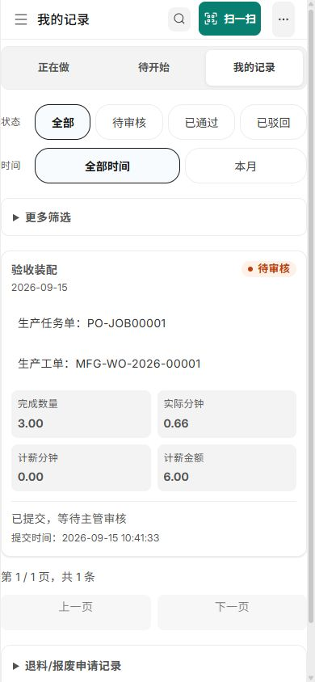
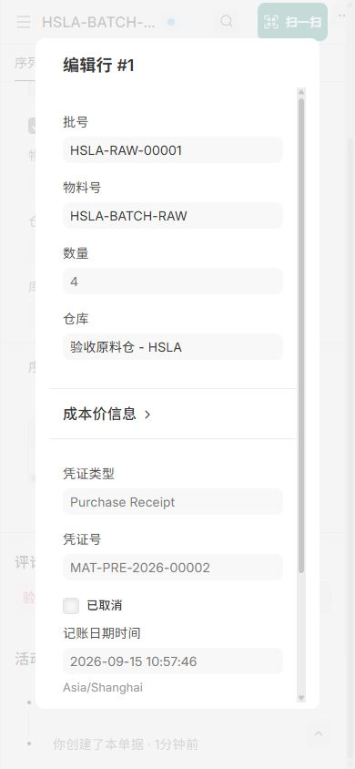
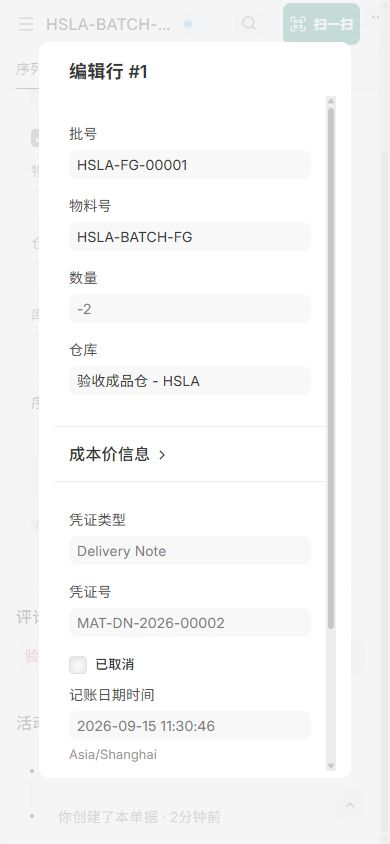
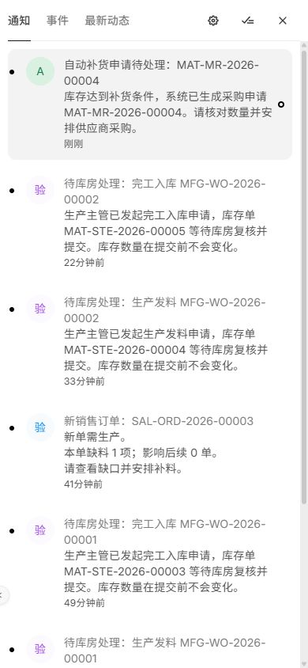
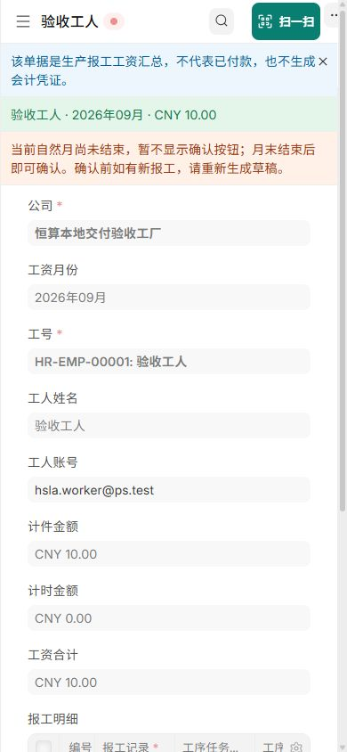

# 恒算 ERP 最新版本本地交付验收

> 2026-09-17 更新：批次兼容功能已发布到生产，批次保持关闭；初始化与桌面导航问题已补测。详见 [生产发布记录](production_release_20260917.md)。本文原日期的失败与验收边界继续保留。

**更正结论（2026-09-15）：业务专项已通过，整站验收未通过，暂不交付。**撤回此前“本轮约定的本地验收通过”的结论。验收时间为 2026-09-15。按用户确认，移动端采用浏览器手机视口实际操作；实机、摄像头扫码、现场打印机不作为本轮完成条件。本记录只证明下面列明的范围，不表示已部署正式站。

## 用户复核发现的问题与验收失误

用户自行验证时发现，Administrator 点击“桌面”会返回恒算经营总览。重新核查发现，业务验收站与恢复站均已标记初始化完成，但原生默认值 `desktop:home_page` 仍为 `setup-wizard`。点击桌面误进初始化向导，向导整页跳转后再次触发岗位首页。生产站同一点击操作返回原生桌面正常；生产、本机及 Git 基线的角色首页前端脚本完全一致。

问题来源为本次验收环境准备脚本：直接调用 ERPNext 建账并设置完成标记，遗漏 Frappe 初始化收尾。此前将该现象直接归因为原有角色首页设计不当的判断撤回；尚未修改产品代码或两站配置。

验收存在三项缺口：一是新站只验证到登录和初始化向导入口，没有走完用户可见的初始化流程；二是主要通过业务页面直达地址验收，漏测手动返回原生桌面；三是备份恢复只核对数据一致性，未识别错误默认值也被完整恢复。原业务用例结果保留，但不能据此宣称整站通过。

本问题尚未关闭。重新给出整站通过结论前，需完成验收环境初始化收尾，并从正常登录入口核对岗位首页、手动返回桌面、刷新、退出重登、直达单据和恢复站导航；移动范围仍按用户确认的浏览器手机模拟执行。既有全新安装站尚未建账，不能将其正常的初始化向导状态当作本缺陷而直接更改。

## 2026-09-17 发布前补测进展

业务验收站与恢复站已执行 Frappe 原生 `run_post_setup_complete`，默认值由 `setup-wizard` 回到 `workspace`，引导结果为 `desktop`。原验收数据准备脚本同步补齐该阶段。Administrator 从正常登录入口到经营总览，再实际点击菜单“桌面”，已显示原生模块桌面。此操作未修改角色首页产品脚本或生产配置。

刷新 `/desk` 仍按已有岗位首页规则进入经营总览，这是本次发布前已存在的行为；明确桌面地址 `/desk/desktop` 可用于刷新保持原生桌面。本轮不改变这项岗位首页设计。增加只读发布检查，拒绝“初始化已完成但默认页仍为向导”的站点，避免再次仅凭数据摘要给出通过结论。完整补测及生产发布结果另见后续发布记录，本文保留 9 月 15 日的失败结论和证据，不追溯改写为当时已通过。

## 验收结果

| 验收项 | 结果 | 核对依据 |
|---|---|---|
| 原生桌面导航与初始化收尾 | 未通过 | 业务验收站与恢复站残留 setup-wizard 默认首页；用户发现，尚未修复 |
| 固定最新代码及交付镜像 | 通过 | 工作区输入清单、镜像 ID、335 个应用文件和两类原生补丁指纹一致 |
| 全新安装 | 部分通过 | 独立新站安装及迁移成功；公司 0、岗位首页 8 行、批次默认关闭；浏览器登录进入初始化向导；完整初始化收尾尚未通过用户流程验收 |
| 已有业务升级 | 数据核对通过 | 候选 4 升级前后 36 类业务表、附件、密钥和解密探针完全一致 |
| 普通物料完整岗位订单 | 通过 | 销售至发货全部由实际岗位在 390×844 浏览器操作；3 件成品对应 6 件原料，全部发货 |
| 自动批次完整岗位订单 | 通过 | 4 件原料收货、发料、耗用使用 HSLA-RAW-00001；2 件成品自动生成 HSLA-FG-00001 并预留、发货 |
| 自动补货真实后台链 | 通过 | 实际调度器发现到期任务、入队、工作进程重启执行、生成申请、库房收到通知并打开原单 |
| 重复执行与关键并发 | 通过 | 重复调度不重复生成申请或通知；最终镜像上两个数据库连接争用最后可用库存、同一来源均安全拒绝重复占用 |
| 手机浏览器岗位操作 | 通过 | 销售、生产、采购负责人、库房、工人、工资核算、权限管理员；报工、审批、原生单据和批次查看可用 |
| 完整备份及异库恢复 | 数据核对通过，功能验收未通过 | SQL、公开/私有附件及配置恢复；40 类数据指纹、附件、密钥及解密探针相同；恢复站岗位登录和原单查看成功，但错误的初始化首页默认值也被恢复 |
| 权限与环境收尾 | 部分通过 | 私有附件匿名 403、授权登录 200；测试/开发模式关闭，恢复站后台暂停，主业务容器保持停止 |

## 本次固定的镜像

- 镜像：`hengsuan/erpnext:v16.33.0-hs.local-acceptance-20260915.4`
- 镜像 ID：`sha256:dcf0ea9d1c93eaaf13ba155c4f82af49dc208e021f7393496a223b8140debe0b`
- 工作区快照：`98c555cbcbe8355fa58a8414dda28054d7a684b511ef818ccbbc774ab81c83a0`
- 源码标识：`6b482fcf57fcfff29a8b21d789c3eee1289fa691-worktree-98c555cbcbe8`
- Frappe：`5cba016e86b54b57f34a3864282b92300ef20fb0`；ERPNext：`b24c9eba551905e256e336ff170a91a92d197a2f`。

本地使用明确的工作区快照构建，包含当前未提交的兼容代码；未提交或推送 Git，未部署正式环境。原来仅打包 HEAD 的构建方式会漏掉未提交代码，现增加显式快照模式；正常发布构建仍默认已提交源码。ERPNext 补货修复也已纳入补丁及指纹清单。

## 普通订单：默认不用批次

销售 hsla.sales 创建 SAL-ORD-2026-00002（3×50=150 元）；生产 hsla.production 创建 MFG-PP-2026-00001 / MFG-WO-2026-00001；采购负责人 hsla.owner 创建 MAT-MR-2026-00001 并提交 PUR-ORD-2026-00001（原料 6×10=60 元）。库房 hsla.warehouse 提交 MAT-PRE-2026-00001 收货、MAT-STE-2026-00002 发料。

主管派给 HR-EMP-00001 后，hsla.worker 在手机视口开始、暂停、继续、结束计时，提交 JCWR-2026-00001：3 件，有效 0.66 分钟，计件金额 6 元。主管审核通过后 PO-JOB00001 完成，但成品库存仍为 0。主管申请、库房提交 MAT-STE-2026-00003 后入库 3 件，再预留成品并提交 MAT-DN-2026-00001 发货。

最终发货率 100%；相关实际库存与预留均为 0，6 条库存流水没有批次包，库存价值收发净额 0。本单全流程执行时批次总开关为 0；随后开启批次验收，普通物料的批次标记仍为 0。

## 批次订单：自动批号，保留原生产计划逻辑

明确在隔离验收站开启批次、自动出库选批、自动预留，FIFO；物料启用批次及自动创建批号。原料序列 HSLA-RAW-.#####，成品序列 HSLA-FG-.#####。未修改生产计划分配逻辑。

| 环节 | 原单 | 数量和批次 |
|---|---|---|
| 销售、计划、工单 | SAL-ORD-2026-00003 / MFG-PP-2026-00002 / MFG-WO-2026-00002 | 2 件成品，销售 120 元 |
| 采购申请及采购 | MAT-MR-2026-00002 / PUR-ORD-2026-00002 | 4 件原料，采购 40 元 |
| 收货 | MAT-PRE-2026-00002 | 自动生成 HSLA-RAW-00001，+4 |
| 发料 | MAT-STE-2026-00004 | 原料仓 -4、在制仓 +4，均为 HSLA-RAW-00001 |
| 实际报工、审核 | JCWR-2026-00002 / PO-JOB00002 | 2 件，有效 0.31 分钟，计件金额 4 元 |
| 制造入库 | MAT-STE-2026-00005 | 耗用 HSLA-RAW-00001 4 件；自动生成 HSLA-FG-00001 2 件 |
| 成品预留 | MAT-SRE-2026-00006 | 来源为上述制造单成品行，HSLA-FG-00001 2 件 |
| 发货 | MAT-DN-2026-00002 | HSLA-FG-00001 -2，预留及预留明细已交数量均为 2 |

未人工补填本流程的批号。最终订单发货率 100%，相关原料、在制和成品库存及预留均为 0；6 条库存流水均有原生批次包，库存价值收发净额为 0。普通订单和批次订单主体在固定候选 3 执行；发现下述发货设置组合缺口后升级候选 4，保留数据并重新打开同一发货草稿完成提交，最终数量再次核对。

## 验收中发现并关闭的问题

1. **全新安装岗位首页未初始化。**默认开关提前写入后，原代码误判为已有配置。候选 2 仅调整顺序仍失败；候选 3 使用新安装标记初始化 8 行，升级保留明确保存过的空表或关闭设置。6 项单元、6 项数据库集成测试通过，最终候选 4 全新安装再次验证。
2. **原生批次字段显示设置影响快速发货。**use_serial_batch_fields=1 时，原生预留库存映射遗漏批次包，提交报 Serial and Batch Bundle None not found。失败事务完整回滚。现由恒算快速发货入口调用原生方法补齐已预留批次，不更改全局设置；已编辑的不匹配数量会提示核对，已有完整批次包保留。两种显示设置、多批次、取消回退、旧草稿恢复及重复点击共 4 项单元、11 项集成测试通过。候选 4 手机浏览器提交原草稿成功。
3. **原生自动补货未通知恒算岗位。**实际生成 MAT-MR-2026-00003 后通知为空。现对原生自动采购申请提交发送现有“缺料采购”职责的站内通知；普通手工申请不触发该通知。通知模块 10 项单元、15 项集成通过；候选 4 的实际后台任务生成 MAT-MR-2026-00004 并通知 hsla.warehouse，手机页面可以打开原单。
4. **打包缺少未提交代码及 ERPNext 补丁。**增加工作区快照构建与补丁校验。两项补丁应用测试通过，包括首次应用、重复应用及未知源码拒绝。

以上修复以最终镜像中的文件指纹确认，不以本机源码存在代替镜像交付证据。

## 自动补货、队列和并发

测试原料 HSLA-REORDER-RAW 实存 2。初始补货点 5、补货量 4，实际调度器把原生 Daily Maintenance 任务 pcbi5ntvn9 放入 long 队列。停止工作进程时重复调度仍只有同一个任务；启动后日志 Complete，生成采购申请 4 件，预计库存变为 6。

候选 4 将该测试物料补货点设为 9，实际调度生成第二张申请 4 件，预计库存变为 10，库房收到一条通知。再次让同一任务到期，验证排队和工作进程重启：第三次执行 Complete，申请仍只有前述两张，通知仍只有一条。没有直接调用补货业务函数来代替实际后台证据。临时 10 秒调度检查间隔已移除，恢复原有默认间隔。

最终镜像再次执行两个独立数据库连接测试：最后一份可用批次库存只能预留一次；同一来源只能认领一次，即使同仓还有 9 件其他批次，也不能替代来源重复认领。测试生成的独立库存和预留已按原生取消流程清理，审计历史保留。这是受控的双连接冲突验证，不是大规模压力测试。

## 手机岗位验收

390×844 浏览器实际执行销售、计划、采购、收发、派工、工人计时与报工、审核、入库、成品预留及发货。另用工资账号生成 MWWS-2026-00001，核对两条已审核报工合计 10 元；按系统规则本月尚未结束，工资保留草稿。权限管理员能选择库房账号，读取其单一公司和四个验收仓库授权，没有修改权限。

工资和权限页面实测页面宽度与文档宽度均为 390，无整页横向溢出。原生单据明细可展开查看完整批号、数量、仓库和凭证。数量及链接输入使用真实键盘事件并失焦确认；自动化直接填值未触发前端事件时不计为业务成功或产品故障。额外 320 宽度覆盖未实际生效，不计为通过；本轮手机证据以已测量的 390×844 为准。

## 备份恢复及隔离环境

最终备份时间戳 20260915_114043，包含数据库 SQL.gz、public files.tar、private files.tar 和站点配置。备份复制后逐件核对 SHA-256。在 restore 独立数据库执行原生恢复和迁移，保留目标数据库连接配置，恢复原加密密钥；40 类数据（含工资、通知和后台日志）、公开/私有文件、密钥和解密探针完全一致。

恢复脚本第一次仍按旧备份的 .tgz 后缀查找，未开始导入；调整为读取实际 .tar/.tgz 文件后成功。失败及成功日志均保留。恢复站浏览器用库房账号登录，看到 MAT-DN-2026-00002 待开票、2 件、120 元；附件经原生认证 HTTP 读取均为 200 且摘要一致，匿名访问私有附件为 403。附件的内容访问以 HTTP 校验为依据，不声称浏览器内预览了文本附件。

| 环境 | 地址 | 最终状态 |
|---|---|---|
| 业务流程验收站 | http://hsla-upgrade-20260915.localhost:18081 | 候选 4，后台正常运行；仅合成验收数据 |
| 全新安装站 | http://hsla-fresh4-20260915.localhost:18082 | 候选 4，原生初始化向导，批次默认关闭 |
| 恢复核对站 | http://hsla-restore-20260915.localhost:18083 | 候选 4，后台队列和调度保持暂停，供只读复核 |

入口均仅绑定本机 127.0.0.1。沿用生产 Compose 服务结构，3 个 Gunicorn 进程×4 线程。Docker 内部的同名 HTTP 路由用于本地实时服务回连，没有关闭来源或会话校验。18 个应用服务容器的镜像一致；恢复站三个后台容器按计划停止，其余服务运行正常。三站 ping、登录页和两项静态资源共 12 项 HTTP 检查均为 200，所有站点测试及开发开关关闭。原回归站 allow_tests 也已关闭，主业务容器 erpnext-v16-development-frappe-1 仍停止。

## 飞书使用说明同步

已于 2026-09-15 更新现有 [09｜批次自动管理与追溯](https://rcnz1aofm14f.feishu.cn/wiki/JAzTwkSITixJK2kGv1JcIZPundh)，文档修订版本 38。将旧教学数量例子替换为本次实际完成的“4 件原料 → 2 件成品 → 全部发货”，配套收货和发货批次截图；说明系统自动编号、预留及选批、岗位核对责任和本地验收边界。写入后重新读取，确认五步操作、两张图片及旧资源均保留正确。随后因用户发现桌面导航缺陷，撤回飞书中的整站通过结论，保留批次业务示例并标记整站验收未通过。

## 证据位置与范围

详细证据位于 `development/logs/local-acceptance-20260915/`，私密配置保留在受限本地目录，不进入 Git 或本报告：

- `candidate4/source-manifest.json`、`build-image.log`、`fresh-image-verification.json`、`before-upgrade.json`、`after-upgrade.json`。
- `plain-completed.json`、`batch-completed.json` 及分环节 `plain-*.json`、`batch-*.json`。
- `candidate4/scheduler-run.json`、`scheduler-retry-queued.json`、`scheduler-retry-finished.json`、`concurrency-tests.log`。
- `candidate4/before-final-backup.json`、`after-final-restore.json`、`restore-comparison.json`、`backup-checksums.json`、`restore-native.log`、`restore-http-attachments.json`、`final-health.json`。

[前置测试审计](pre_delivery_audit_20260914.md) 的 1207 项结果与本轮定向测试、真实岗位流程分别记录，不将重复测试累加成新的覆盖数。本轮没有要求真实手机/PWA 独立模式、摄像头、扫码硬件、实体打印机、生产部署或付款开票验收；这些不作为本轮完成条件；当前阻止整站验收通过的是上文列明的初始化收尾和原生桌面导航问题。
