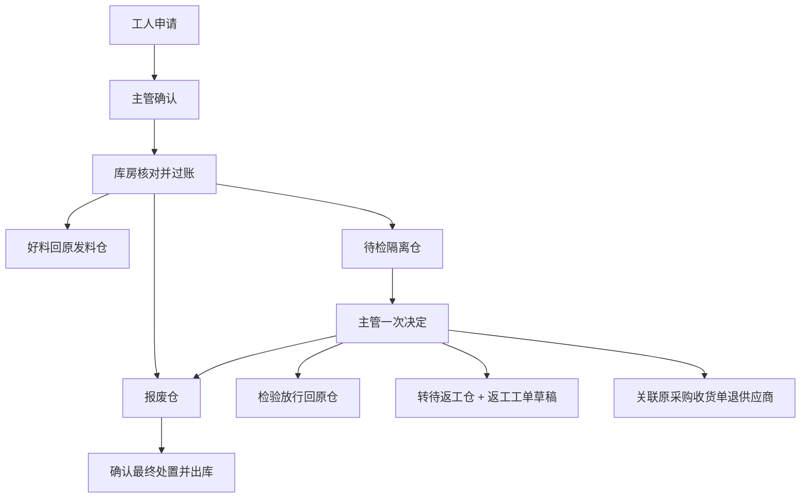

# 生产退料、待检、报废与补料闭环

更新：2026-09-11。适用当前恒算 ERP / ERPNext v16 开发站点。

## 工厂操作路径

| 谁操作 | 从哪里进入 | 需要填写 | 下一步 |
| --- | --- | --- | --- |
| 工人 | 我的任务 → 对应任务 → 申请退料/报废 | 选场景、物料、实际数量；说明选填 | 主管确认，库房收料过账 |
| 主管 | 异常审核 → 待主管审核 | 核对数量；默认保留任务，必要时改为交回剩余任务 | 系统生成库存草稿 |
| 库房/主管 | 异常审核 → 完工/停工退余料 | 选工单，可一次填写多行余料数量 | 普通好料直接等待库房收料；质量异常仍需主管决定 |
| 主管/库房 | 异常审核 → 待检/报废处置 | 选原退料单、处理方式、实际数量 | 主管的处理决定即审核；库房核对实物后过账 |
| 工人 | 我的记录 → 待审核异常 → 撤回重填 | 撤回原因 | 重新按正确数量申请 |
| 主管/申请人 | 异常审核 → 未过账处理单 → 撤回重填 | 撤回原因 | 原草稿保留追溯并禁止提交 |

工人的四个场景：退回未用物料、物料有问题先退待检、物料报废、生产损耗。不要求工人选仓库、BOM 或返工策略。物料只有一项时自动选中，数量按库存单位显示，并给出个人可申请上限。配置缺失与没有可退物料分别提示；配置后可点“刷新物料”。

常规物料流程只有主管确认、库房过账两个业务环节。主管自己发起的处置决定不再重复审批；普通收尾好料退回不增加主管审批。库房没有主管权限时，质量处置仍进入待确认状态。各状态通知相应负责人，页面保留未完待办和最近处理记录。

## 仓库在哪里设置

搜索并打开“公司” → 恒算科技 → 库存与生产 → 生产：

- 默认报废仓：`报废仓 - 恒`。在产工单优先使用其报废仓，未设置时回退公司默认值。
- 生产异常待检隔离仓：`待检隔离仓 - 恒`。
- 待返工仓：`待返工仓 - 恒`。

当前开发站点已配置以上三个仓库。新增仓库可以从“仓库”列表或仓库树建立，但还须填入公司对应设置。仓库需为同公司、启用、非汇总仓；异常仓不得冒用原发料仓或在制品仓。待检仓和报废仓不能相同，返工仓需独立。工人无需申请建仓或配置仓库。

## 状态与库存责任

- 申请和审核均不改变实际库存。待处理数量占用申请额度；只有原生库存单/采购退货单提交后才变更库存。
- 工序生产损耗记录的是本工序产出损失，审核后写入任务单，不冒充合格产出、不计件、不自动移动原料库存。
- “物料报废”先转入报废仓，仍有库存数量和价值。最终“报废处置”生成原生 Material Issue，填写处置依据，由有权限的库房人员核对费用科目后过账。
- 待检放行回原发料仓；确认报废转独立报废仓；处置可按剩余量分多次进行。
- 退供应商必须选同公司已提交的原采购收货单。同料多行时指定原收货行，保留来源行、采购单位换算和批次/序列号；原生校验限制可退量。确认弹窗展示供应商、原单和退货合计，价格及附加费用应在原生草稿上核对。
- 返工要求选择已提交、启用、同公司的有效 BOM，一次处理一种待返工料。系统生成转仓单和返工工单草稿。转仓完成后方可提交返工工单，所用异常料的仓库和数量必须与决定一致。返工后续按正常生产、报工、入库流程操作。
- Completed / Stopped / Closed 工单均可退回未耗用余料；提交或取消收尾退料不会重开原工单。

## MRP 数量口径

以已提交的 Stock Entry Detail 为事实来源，保留“实际物料、原 BOM 组件、原发料仓、在制品仓、库存单位、批次/序列号”。

1. 可退余量 = 该来源实际发到 WIP 的量 − 已耗用量 − 已过账退回量；再扣除未完成申请，并受个人派工额度约束。
2. 净发料覆盖量 = 累计发料量 − 已过账退料量。退原仓、退待检仓、退报废仓都要减少原工单净覆盖量，不能因目标仓不同而漏算。
3. 在产工单按组件净缺口补料。普通好料退原仓后可成为后续发料供应；待检/报废仓库存不混入正常发料仓的可用库存。采购缺口再抵扣有效库存、占用和在途供应，不按退料量直接创建采购订单。
4. 默认保留工人任务，补足物料后继续做。主管明确选择交回剩余任务时，库存过账才释放未完成产量；不能释放已报工部分。
5. 替代料退库移动实际替代料的库存，其覆盖/缺口归入原 BOM 组件。多工序重复组件只分配一次总流水，避免重复计算发料。
6. 原料支持库存单位的小数数量；必须整件的单位和序列号料保持整数。批次和序列号跟随实际发料来源，分次处置扣除已用身份，不能串用其他来源。
7. 过账前重新检查实际仓库余额；本流程不允许凭空出库，即使站点开启原生负库存选项。

未标明来源的非跟踪耗用按稳定的发料顺序归属；有批次/序列号时必须匹配身份。历史退料若有多个原发料来源且无法明确归属，阻止自动猜测并提示核对。

## 撤回、取消与并发

- 待审核申请：工人可撤回自己的申请，主管可驳回。改数量采用撤回重填，保留原始事实。
- 已批准未过账：主管或相应处理申请人撤回后，旧草稿不能再提交；不直接覆盖审批数量、物料或仓库。
- 已过账：先走关联原生单据取消。收尾/处置申请回到待确认；在产退料恢复相应库存和派工事实。
- 已产生后续放行、报废、返工或供应商退货时，先处理后续单据，再取消来源单，避免库存链断裂。
- 已重新派工的原退料不能直接取消；即使新工人已经报工，旧退料也不能反向改写其任务和工资事实。应保留原单并按补料等正向业务纠正。
- 已提交返工工单时，禁止先取消转仓单。
- 重复请求只返回同一申请；同一个请求编号更换数量、来源或采购行会被拒绝。
- 关键数量使用父单锁和当前读取，处理 MariaDB 旧快照冲突；接口只在完整请求事务边界重试可重试冲突。
- 待办不按最新历史记录截断，尚有余量的旧退料来源继续可选。

## 本次验证与范围

独立回归站点 `v10t-regression.localhost`：

| 范围 | 用例数 | 证据 |
| --- | ---: | --- |
| 报工、个人额度、在产异常、收尾、处置闭环 | 82 | 完整回归及修复后定向复测通过 |
| 库存钩子与多工序共享料 | 24 | 23 个单元测试、1 个原生过账/取消集成测试通过 |
| 齐套与库存分配 | 47 | 通过 |
| 净发料、退料后补料 | 29 | 通过 |
| 多来源、批次、序列号事实归属 | 3 | 通过 |
| 异常审核权限与历史 | 2 | 通过 |
| 前端报工及撤回交互 | 28 | 通过 |

共 215 个相关用例；不把定向复测重复计数。实际库存集成场景包括普通退料、报废、隔离后部分放行/部分报废/最终处置、原生供应商退货提交取消、返工转仓及工单提交保护、三个终态余料退回、批次小数、序列号分次处置、替代料报废及取消、退料取消后重做、已重新派工并报工后的取消拦截。

当前 `development.localhost` 已同步本功能 DocType、字段、查询索引与资源，并配置三种异常仓。使用已有李四账号只读查询 `JCWA-2026-00123`，PA6 30% 返回可退 1000 Gram，原仓、报废仓和待检仓均有路径。未向当前业务站点创建测试库存单、采购退货单或返工工单。

手机尺寸 390 × 844 已检查主管入口、终态工单查询和表单宽度。真实手机、工人/主管/库房现有账号轮转操作，以及真实批次实物、税费和会计科目确认，仍需现场验收。当前结论：**带限制试用**，不等同于生产环境正式交付或已经覆盖所有可能业务。

## 原生业务边界

- 采购换货后的重新收货、退款结算、税费处理继续走原生采购和财务单据；本流程提供有来源的退货入口，不自动决定商业结算。
- 返工仅覆盖有效原生 BOM 能表达的生产路径；拆解回收、多种输出分摊、循环 BOM 或另设返修业务不是自动生成任意 BOM。
- 订单减产、取消客户需求不由“退料”隐式触发。停止后是否恢复生产由主管在生产计划中明确决定。
- 多来源无批次库存只能按账面规则归属；历史来源缺失及绕过本流程的手工库存更正需要核账。系统过账保护不能代替现场实物核对。
