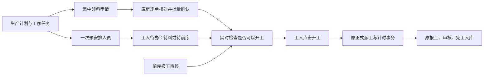

# 提前安排与集中领料：实施方案

日期：2026-09-30。分支：`codex/operation-dispatch-pool`。本文件承接 2026-09-28 的集中首次派工版本，当前交付范围以本文为准。

目标是减少主管逐工单领料、等前序再逐工序派工的操作。现场生产仍由独立工单、工序任务、个人报工和原库存单据记录。操作合并，业务归属不合并。

## 人员实际怎么用

| 岗位 | 操作路径 | 可以省掉的操作 |
| --- | --- | --- |
| 老板 / 主管 | 快速开单、创建计划后，进入生产计划中心的“安排人员”，勾选任务；按工序套用常用人员，预览并一次保存 | 不必先领料；不用等上一道完成才安排下一道；不必反复进入每个工单选择人员 |
| 主管 | “领料出库”选中待领料工单，核对逐单物料和覆盖数量，一次申请 | 不必逐工单打开领料入口 |
| 库房 | “集中领料出库”核对选中申请的原料、数量及仓库，批量确认普通物料出库 | 不必逐张打开普通发料单提交 |
| 工人 | “待开始”查看本人安排及待料、待前序、可开工；就绪后点开工 | 不用找主管重复派工；沿用正在做、暂停、报工操作 |
| 主管审核 / 库房完工入库 | 沿用现有入口，前序审核与发料会刷新工人待办 | 无新增一轮“预安排转正式派工”的人工确认 |

单次最多明确选择当前页同公司 20 张任务。每张工单或工序的数量、来源与处理结果独立显示。默认人员按公司、工序、审核主管保存；单人自动带入整张任务量，多人必须核对各自数量，总和等于该任务量。默认配置只影响新的建议，不修改已有安排。

已经保存但停止、关闭或失效的工单安排可在“已保存的安排”中查看并撤销。开工后的安排走原派工与异常处理流程，不允许预安排覆盖。

## 统一操作体验（10 月 5 日）

- 订单按产品展示，并直接显示下一步操作；“已建计划”与“已安排人员”分开表达，避免将创建计划误认为已派人。
- 生产计划中心统一为“订单与进度”“安排人员”“领料出库”三个入口；审核页的安排入口直接进入人员安排。
- 工人使用统一任务队列，优先显示可开工任务，再显示待前序、待料和需处理的任务；重复点击及网络结果不明时先核实任务状态。
- 仓库优先展示待办任务，库存和历史查询作为辅助入口；订单、生产、仓库和工人页面共用按钮及移动端样式。
- 快速开单首次打开只建立数据版本基线，不显示“数据有更新”；后续确有更新时，根据是否已经填写内容显示准确提示。

10 月 7 日代码检查补充修正：直耗料工单的工人待办就绪判断，按已保存安排的主管权限读取物料状态，避免工人没有生产池读取权限时误报“工单权限不足”。只返回该安排的开工状态，读取不产生库存预留、正式派工或报工，会话身份始终恢复；正式开工继续使用原有校验。

## 业务边界

新增 `Job Card Prearrangement`、其人员子表及 `Operation Worker Default`。保存和读取安排不产生正式派工、物料预留、库存流水、工资或计时。首次工人开工时，依据主管保存的人员及数量，在同一个事务中执行原正式派工、安排激活及原开工服务。任何一步失败均由请求事务整体回滚。

人员资格、公司范围、主管权限、工单身份、数量快照、前序数量、实际物料、工资配置及已有报工历史均在写入时重新检查。工人不能通过开工接口自行指定主管、人员或数量。主管授权执行时保留并恢复真实工人 HTTP 会话信息，记录实际激活人。

每张领料申请仍由原服务创建并锁料，每张实际出库仍提交原 `Stock Entry`。跨工单只合并页面操作，不合并库存单。不同公司不能一批处理；不自动覆盖物料优先级。含批次或序列号的出库先引导回原单核对具体明细，未对其开放集中提交。

同一工单内普通工序不增加工序间入库动作；涉及独立半成品工单、按工序跟踪半成品、外协等特殊路径，沿用原业务入口。此次没有放开首次部分发料开工、前序部分报工直接流入后序、部分完工入库等数量规则。已有部分发料功能保留；安排人员可以提前完成，并不等于物料未满足时允许开工。

## 风险控制与剩余限制

- 预安排版本号防止覆盖另一位主管的新安排；首次正式派工继续拒绝已有生产历史；工人开工请求有幂等标识。
- 集中操作每张单独立事务，顺序执行并显示成功、失败、尚未处理及待核实状态。停止只停止尚未提交的请求，不撤销已完成业务。
- 库存单确认覆盖完整单据摘要；单据、工单及子行在锁定后重新读取。实际库存、预留和用料事实仍在过账前复核；不能依据旧页面直接提交。
- 网络结果不明时先核实服务器事实，不直接重发。读取本身没有领料、预留、派工或计时副作用。
- 发料和前序审核按工单查找预安排中的工人，发送不含业务内容的刷新提示；工人只重新读取本人任务。停用计划也会刷新待办。
- 预安排不等于产能排程：不会自动保证同一工人的多个任务时间不冲突。实际仍保留“一人同时一个进行中的作业会话”，主管可以调整未开工安排。
- 追溯精度维持原系统能力。订单、工单、工序、人员、库存单及原批次明细保留；不宣称新增了每箱实物与单个工人的绑定。
- 新增计划生命周期与批量库存入口属于需要验收的业务改动，不能认为零风险。9 月 30 日首轮发布仅限本地试用站；10 月 5 日已部署到 demoerp 演示环境，生产环境未在此次范围内更新。

## 上线与回退

需要随代码执行站点迁移以增加三个 DocType；不迁移或重写历史工单、报工或库存。复用站点开关 `enable_operation_dispatch_pool`。公司与岗位权限照旧。

关闭开关会停止新增安排、预安排开工和集中领料入口；已经正式激活的任务可继续走原派工、报工及库存入口。关闭前应完成或撤销尚未激活的安排，避免工人留下不可开工的待办。原始库存与生产事实不随开关回滚，也不能通过删除新表回退已执行的生产。

本地验证使用独立 `returns-test.localhost` 测试库，以及从试用站数据库备份恢复的 `efficiency-test.localhost` 浏览器验收副本。验收副本中的取消发料和生产记录只存在于副本。`develop.localhost` 的用户业务记录在部署前后单独核对。

验证结果与本地部署信息见本地目录 `development/production-efficiency-20260930/`；测试数据、账号、数据库备份和截图不纳入应用发布。

## v16 推送前检查（2026-10-07）

- 前端 Node 测试 509 项全部通过。
- 后端在独立 `returns-test.localhost` 执行全应用 1131 项：371 项单元测试、369 项集成测试、391 项未分类测试。2 项依赖预置 QA 岗位账号的测试跳过。
- 全量回归期间修正采购并发测试的站点目录硬编码、仪表盘测试的旧接口引用、备料时间条件，以及采购拒收测试假定记录一定在第一页和缺少逐用例回滚的问题。末轮全量中剩余的拒收失败修正后，两个受影响模块共 24 项补跑全部通过；其他已通过模块未重复运行。
- 直耗料待办权限修复随末轮全量验证：工人可查看就绪任务、读取无业务写入、身份恢复、开工失败回滚均通过。没有为通过测试而放宽库存、派工或报工条件。
- demoerp 的 14 个相关静态资源与当前前端源码一致，6 个岗位账号登录及相关只读接口核验通过。该环境对应 10 月 5 日部署包；本次新增的直耗料待办权限修复尚未部署到 demoerp。

本轮日志保留在本地 `development/v16-release-20261007/`。推送仅包含应用、测试及说明文档，不包含演示账号、数据库备份、教程素材或本地运行数据。
